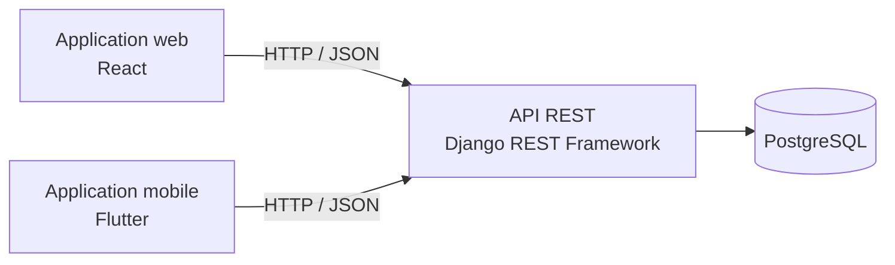

# 🌟 Product Experience Platform


## 📌 Description

**Product Experience Platform** est une plateforme web et mobile où les utilisateurs partagent leurs expériences, avis et recommandations sur des produits.

L'objectif est de créer une communauté qui aide à mieux choisir ses achats. Les produits sont classés par catégories :

- 📱 Électronique
- 👕 Mode
- 🍔 Alimentation
- 🏠 Maison & Décoration
- 🎮 Loisirs
- et bien d'autres

## Sommaire

- [Fonctionnalités](#-fonctionnalités)
- [Architecture](#️-architecture)
- [Technologies](#️-technologies)
- [Installation](#️-installation)
- [Auteure](#-auteure)

## 🚀 Fonctionnalités

### 👤 Utilisateurs

- Création de compte et authentification
- Gestion du profil
- Publication et modification de ses avis
- Interaction avec la communauté

### ⭐ Avis et recommandations

- Ajout d'expériences
- Notation des produits
- Commentaires et recommandations
- Classement des produits populaires

### 🛍️ Produits

- Organisation par catégories
- Recherche de produits
- Consultation des expériences des autres membres
- Filtrage par type de produit

### 📱 Web et mobile

- Interface web responsive
- Application mobile multiplateforme
- Expérience utilisateur fluide

## 🏗️ Architecture

Le projet sépare clairement les clients (web et mobile), l'API et la base de données.



## 🛠️ Technologies

| Couche | Technologies |
|---|---|
| Backend | Python, Django, Django REST Framework |
| Frontend web | React.js |
| Mobile | Flutter |
| Base de données | PostgreSQL |
| DevOps et infrastructure | Docker, Ansible, Vagrant, Ubuntu |
| Gestion de code | Git, GitHub |

## ⚙️ Installation

### 📋 Prérequis

Python 3, Node.js, Flutter SDK, Docker, PostgreSQL et Git.

### 1. Cloner le projet

```bash
git clone https://github.com/BouoniManar/Forum_partage_experience.git
cd Forum_partage_experience
```

### 2. Backend (Django)

```bash
cd backend
python -m venv venv
venv\Scripts\activate             # Windows (PowerShell)
pip install -r requirements.txt
python manage.py migrate
python manage.py runserver
```

Créer au préalable la base PostgreSQL et renseigner ses identifiants dans la configuration du backend (sans jamais publier de mot de passe).

### 3. Frontend web (React)

```bash
cd frontend
npm install
npm start
```

### 4. Application mobile (Flutter)

```bash
cd mobile
flutter pub get
flutter run
```

## 🐳 Déploiement

L'infrastructure est conteneurisée avec **Docker**. **Ansible** et **Vagrant** servent à provisionner et automatiser un environnement Ubuntu reproductible.

<!--
## 📸 Captures d'écran
Ajoute tes images dans un dossier docs/ puis décommente ce bloc :


-->

## 👩‍💻 Auteure

**Manar Bouoni** — Développeuse Full Stack
[GitHub](https://github.com/BouoniManar) · [LinkedIn](https://linkedin.com/in/bouoni-manar-700b90222)
